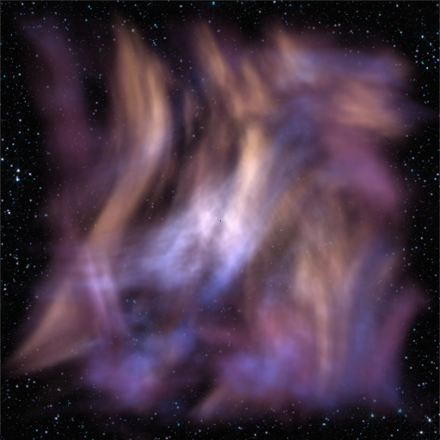
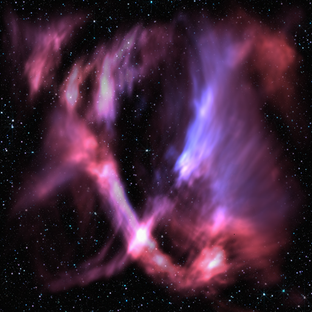
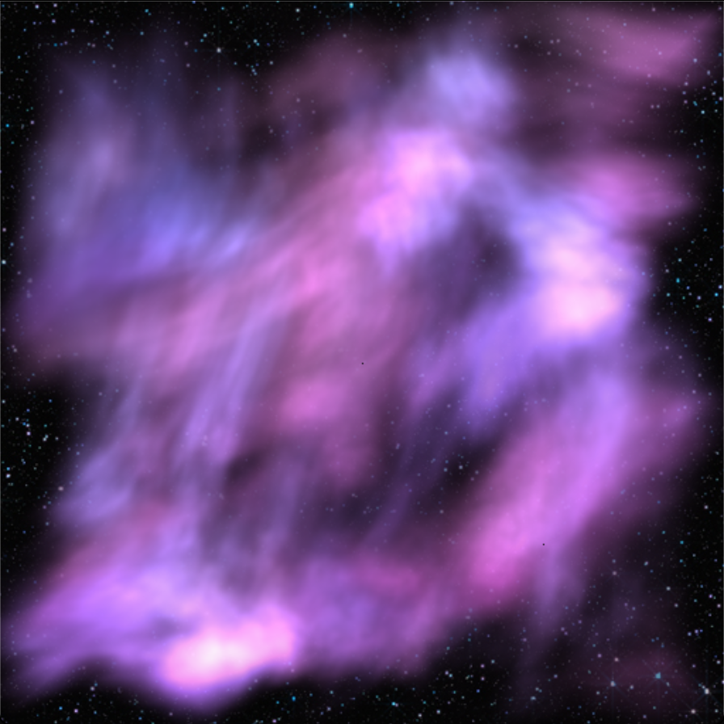
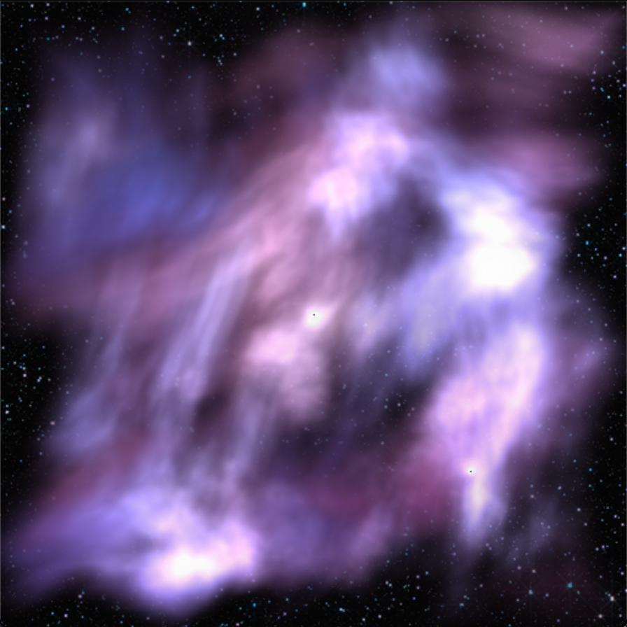
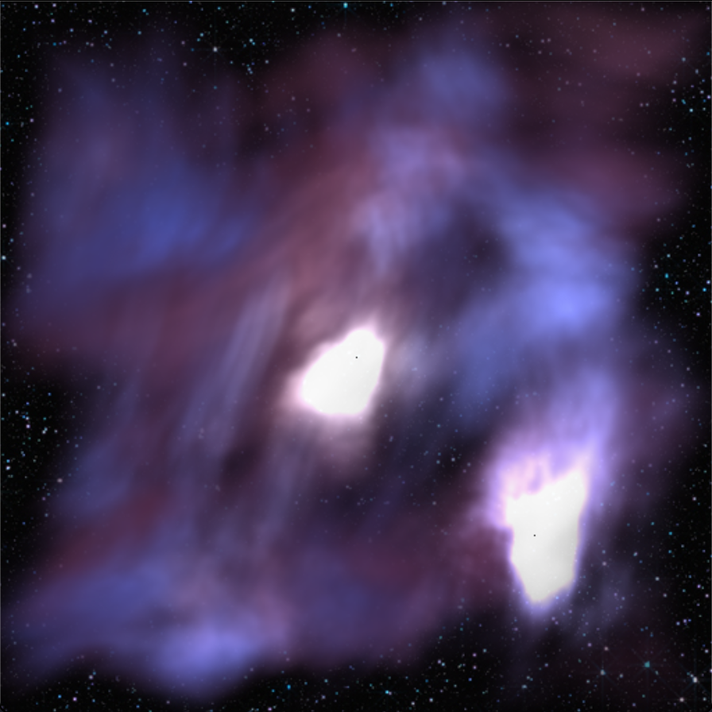
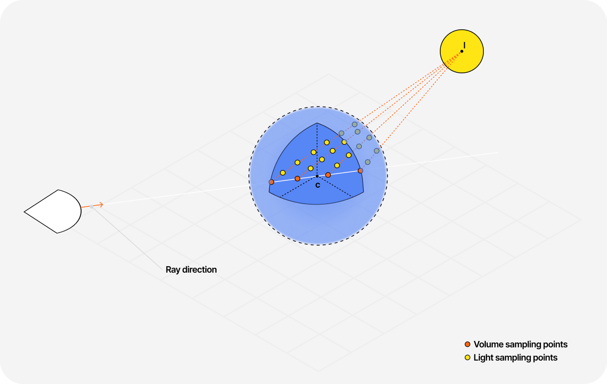
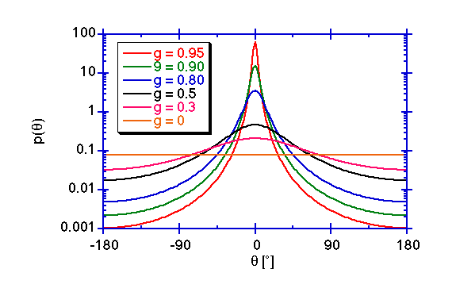

# Nebula Raymarching
A multi-density volumetric CPU renderer which utilises raymarcing and multi-threading. Written in haskell and made for the INF1A FP Competition at the University of Edinburgh

## Usage
The renderer is built using the `gloss` and `pure-noise` packages and will need to installed before running.
```
cabal install gloss --lib
cabal install pure-noise --lib
```
The programm also utilises multithreading and will need to be built with the `-threaded` and ran with `+RTS -N -RTS` inorder to take advantage of this optimisation. If running the program with cabal `cabal run`, it should work fine.

The volume density field and rendering properties can be set in `Main.hs` and `Volume.hs`. There are plans to move these values into a configuration file.

## Renders
- Nebula containing Nitrogen-II, Oxygen-III and Hydrogen-alpha
- Center white light and a directional blue light
- Seed: 80



### Nebulas containing hydrogen-alpha and oxygen-III
| | High samples | Low samples |
| --- | ------------ | ----------- |
| Ray sample steps | 64 | 16 |
| Scattered light steps | 16 | 4 |
| Result | |  |

Seed = 9

##### Phase function g-value
| 0.1 | 0.6 | 0.9 |
| --- | ------------ | ----------- |
|  | |  |

Seed = 69

## How it works
The renderer can be broken down into these categories
### Main window thread and worker threads initalization
A foriegn pointer array is used as a render buffer which the window thread will read from and worker threads will write to.

A major optimisation found was that a lock was not need, usually this would cause race conditions and weird render output however each worker is only small and distinct sections of the buffer therefore there will be no race conditions as they operate on different parts of the array.

### Raymarching
1. The program uses orthographic progection so the rays are all paralel and will step along the z axis.
2. It samples the volume at each step which returns a list of density values which represents a different element.
3. For each density a different transfer function is applied and the ouputs are summed together. The scattered light at the point is also calculated and all accumated.
4. The transmission at each point is calculated based on the step size, opacity and the accumated transmission. The final color and transmittion is calculated and is accumulated. The final color at the pixel is the accumlated color and is calculated by $$\text{Color}\times\text{Scatted light} + \text{Emission}$$


### Transfer function
The transfer function defines a color, emmission and opacity for a given density. It heavily relys on different interpolation functions and color ramps.

Transfer for different elements are supplied such as $\text{H}\alpha$ (red/orange), $\text{O III}$ (blue/cyan), $\text{S II}$ (deep red/pink), and $\text{N II}$ (yellow/orange)

### Volume sampling
Mutli-octave 3D fractal perlin noise is used to generate the base density field of the nebula. To give the density field a more flowly/nebula shape the input domain is warped by a downscaled inner noise. For composite clouds (clouds with multiple densities) the warp uses a different seed to give it the same overall shape but different details.

Further processing such as falloff and cutoff values are applied to create the nebula look.

### Light scattering
Light scattering happens at each step in the main raymarching step. At each point a new ray is marched towards the light and accumates the volumes color along the way and the light at the end of the march.


> Image taken from [this blog](https://blog.maximeheckel.com/posts/real-time-cloudscapes-with-volumetric-raymarching/) 

It also uses the [Henyey-Greenstien Phase Function](https://omlc.org/classroom/ece532/class3/hg.html) to calculate how much light should be accumlated based on the angle to the light source. It takes in a the $\cos\theta$ of the angle between the view ray and the ray to the light and a g value where 0 is total isotropic reflection (equal scattering in all directions) and greater g value means more specular like reflections.

